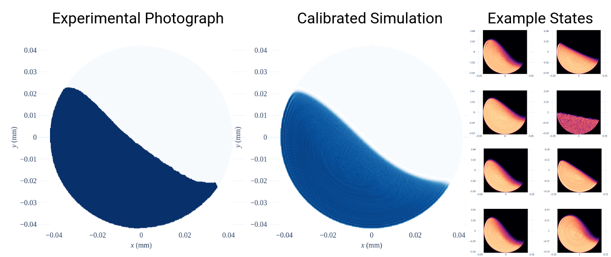

..
   File   : index.rst
   License: GNU v3.0
   Author : Andrei Leonard Nicusan <a.l.nicusan@bham.ac.uk>
   Date   : 28.06.2020

===================
ACCES Documentation
===================

ACCES (Autonomous Characterisation and Calibration via Evolutionary Simulation)
learns simulation parameters by minimising a user-defined objective. Install and
import the library as ``coexist``.

``coexist.Access`` parallelises user-defined simulation scripts on a laptop or
cluster. It is independent of the simulation engine: a script defines its free
parameters, runs a simulation, and returns an objective value. ``AccessData``
reads the resulting parameter evaluations and optimisation progress.

The optional ``coexist.sensitivity`` module uses existing evaluations to explore
how parameters can vary while keeping a fitted response within a chosen
objective tolerance. No additional simulations are required.

Tutorials and Documentation
===========================
At the top of this page, see the "Getting Started" tab for installation help; the
"Tutorials" section has some explained high-level examples of the library. Finally,
all exported functions are documented in the "Manual".

Contributing
============
This library is still in its early stages, so large changes and improvements
(sometimes breaking) are still expected; on the flipside, you can still shape the
future of it! Sharing tutorials, documentation, suggestions and new functionality
is more than welcome.

Copyright
=========
Copyright (C) 2020-2026 the `Coexist` developers. Until now, this library was built
directly or indirectly through the brain-time of:

- Andrei Leonard Nicusan (University of Birmingham)
- Dominik Werner (University of Birmingham)
- Dr. Kit Windows-Yule (University of Birmingham)
- Prof. Jonathan Seville (University of Birmingham)

Thank you.

Indices and tables
==================

.. toctree::
   :caption: Documentation
   :maxdepth: 2

   getting_started
   tutorials/index
   manual/index

Pages

* :ref:`genindex`
* :ref:`modindex`
* :ref:`search`
