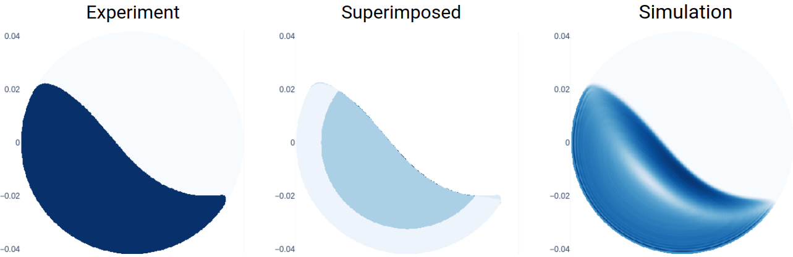

..
   File   : index.rst
   License: GNU v3.0
   Author : Andrei Leonard Nicusan <a.l.nicusan@bham.ac.uk>
   Date   : 28.06.2020

===================================
The Coexist Library's Documentation
===================================

A Python library for autonomously learning simulation parameters from experimental
data, from the *micro* to the *macro*, from laptops to clusters.

Coupling Macroscopic Measurements with Microscopic Simulation Parameters
========================================================================

Autonomously learn a given set of free parameters, such that an experiment is
synchronised with an equivalent simulation. This synchronisation can be done in
one of two ways:

- **Microscopically**: in a Discrete Element Method (DEM) context, all simulated
  particles follow their experimental counterparts *exactly*. Naturally, this
  technique is limited to dilute systems and experimental imaging techniques
  that can capture the 3D position of all moving particles (e.g. PIV) - however,
  it provides information about the fundamental aspects of particle collision.
- **Macroscopically**: a given simulation reproduces a system-specific macroscopic
  quantity (e.g. residence time distribution, angle of repose). This technique is
  completely agnostic to the simulation method and the quantity to be reproduced.
  In a DEM context, it can train coarse-grained simulations, using larger
  meso-particles to model multiple smaller ones.

The two corresponding algorithms are:

- **CoExSiST**: Coupled Experimental-Simulational Study Tool.
- **ACCES**: Autonomous Characterisation and Calibration via Evolutionary Simulation.

ACCESS was implemented in the ``coexist.Access`` class, providing an interface
that is easy to use, but powerful enough to automatically parallelise arbitrary
Python scripts automatically through code inspection and metaprogramming. It was
used successfully from laptop-scale shared-memory machines to multi-node
supercomputing clusters.

Tutorials and Documentation
===========================
At the top of this page, see the "Getting Started" tab for installation help; the
"Tutorials" section has some explained high-level examples of the library. Finally,
all exported functions are documented in the "Manual".

Contributing
============
This library is still in its early stages, so large changes and improvements
(sometimes breaking) are still expected; on the flipside, you can still shape the
future of it! Sharing tutorials, documentation, suggestions and new functionality
is more than welcome.

Copyright
=========
Copyright (C) 2020-2021 the `Coexist` developers. Until now, this library was built
directly or indirectly through the brain-time of:

- Andrei Leonard Nicusan (University of Birmingham)
- Dominik Werner (University of Birmingham)
- Dr. Kit Windows-Yule (University of Birmingham)
- Prof. Jonathan Seville (University of Birmingham)

Thank you.

Indices and tables
==================

.. toctree::
   :caption: Documentation
   :maxdepth: 2

   getting_started
   tutorials/index
   manual/index

Pages

* :ref:`genindex`
* :ref:`modindex`
* :ref:`search`
