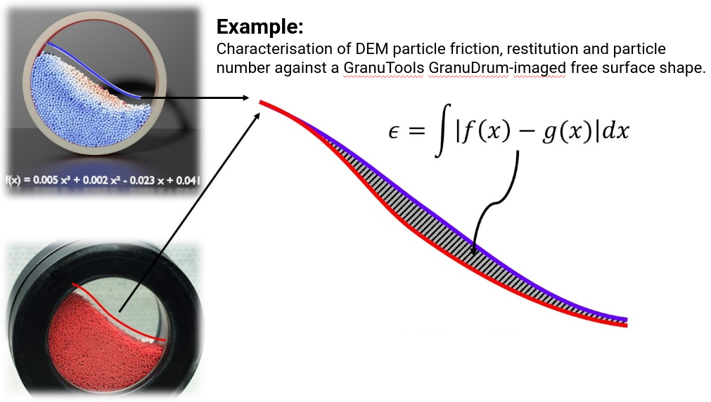
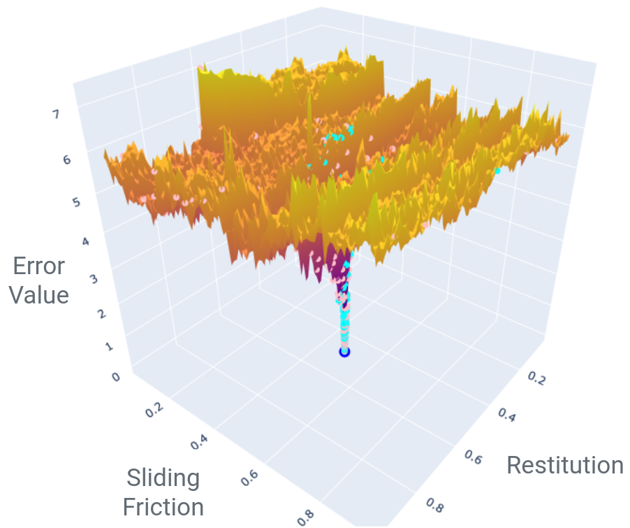
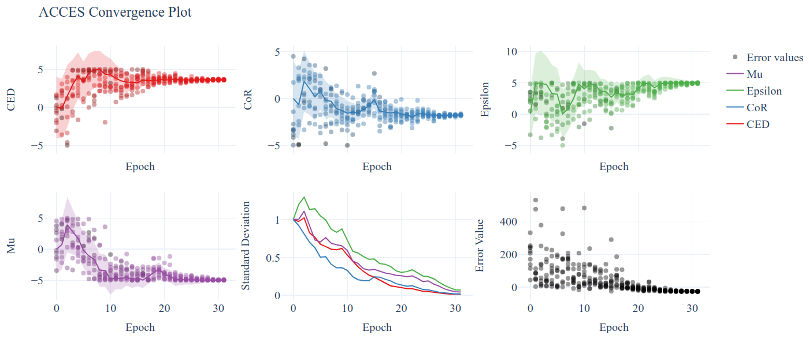
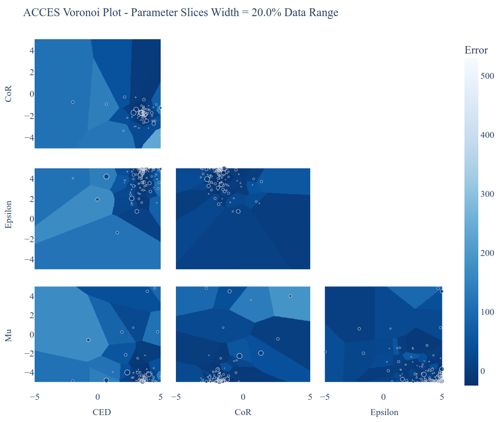

**************
ACCES Tutorial
**************

Introduction
============

ACCES - or *autonomous calibration and characterisation via evolutionary software* -
can calibrate virtually any simulation parameters against a user-defined cost
function, quantifying and then minimising the "difference" between the simulated
system and experimental reality  – in essence, autonomously ‘learning’ the physical
properties of the particles within the system, without the need for human input.
This cost function is completely general, allowing ACCESS to calibrate simulations
against measurements as simple as photographed occupancy plots, or complex system
properties captured through e.g. Lagrangian particle tracking.

But what does this "difference between simulation and reality" look like? Damn awful:

We ran the same DEM simulation of a vibrofluidised bed on a 100x100 grid of
parameters (10,000 simulations indeed, thank you BlueBEAR @Birmingham), then
compared central simulation's occupancy profile with the other simulations.

Fundamentally, this is an optimisation problem: *what parameters do I need such
that my simulation reproduces an experimental measurement*? But it is a horrible
one, with the error function typically being noisy, non-smooth and having many
false, local minima. In mathematical terms, it is non-convex and non-smooth -
so gradient-based optimisers go out the window. Plus, a single simulation (a
single point on the graph above) can take hours or days to run.

Enter CMA-ES [CMAES]_, a gradient-free global optimisation strategy that consistently
ranks amongst the best optimisers for tough, global problems [OptBench]_ which
forms the core of ACCES.

ACCES can take arbitrary Python scripts defining a simulation, automatically
parallelise them to execute efficiently on multithreaded laptops or even distributed
computing clusters and deterministically optimise the user-defined free parameters.
It is fault-tolerant and can return to the latest optimisation state even after e.g.
a system crash.

.. [CMAES] Hansen N, Müller SD, Koumoutsakos P. Reducing the time complexity of the derandomized evolution strategy with covariance matrix adaptation (CMA-ES). Evolutionary computation. 2003 Mar;11(1):1-8.

.. [OptBench] Rios LM, Sahinidis NV. Derivative-free optimization: a review of algorithms and comparison of software implementations. Journal of Global Optimization. 2013 Jul;56(3):1247-93.

Example ACCES Run
=================

Simulations are oftentimes huge beasts that are hard to set up and run correctly /
efficiently; ask a modeller to re-write their simulation as a function (which is
what virtually all optimisers expect) and you might not be friends anymore. ACCES
takes a different approach: it accepts *entire simulation scripts*; so you can
take even pre-existing simulations and just define the free parameters ACCES can
vary at the top, e.g.:

::

    # In file `simulation_script.py`

    #### ACCESS PARAMETERS START
    import coexist

    parameters = coexist.create_parameters(
        variables = ["param1", "param2"],
        minimums = [-1, -3],
        maximums = [5, 3],
        values = [3, 2],                # Optional, initial guess
    )

    access_id = 0                       # Optional, unique ID for each simulation
    #### ACCESS PARAMETERS END

    # The `parameters` variable is a pandas.DataFrame - extract param1, param2
    p1 = parameters.at["param1", "value"]
    p2 = parameters.at["param2", "value"]

    # Define the error value in any way - run a simulation, analyse data, etc.
    error = p1 ** 2 + p2 ** 2

All you need to do is to create a variable called ``parameters`` (a simple
``pandas.DataFrame``) storing the free parameters' names and bounds, and
optionally starting values and relative uncertainty. Then, by the end of
the simulation script, just define a variable named exactly ``error``,
storing a number that will need to be minimised.

Importantly, **the above simulation script can be run on its own** - so
while prototyping your simulation, just run the script and see if a single
simulation works fine; if it does, then you can pass it to ACCES to
optimise the ``error``:

::

    # In file `access_learn.py`, same folder as `simulation_script.py`

    import coexist

    # Use ACCESS to learn a simulation's parameters
    access = coexist.Access("simulation_script.py")
    access.learn(
        num_solutions = 10,         # Number of solutions per epoch
        target_sigma = 0.1,         # Target std-dev (accuracy) of solution
        random_seed = 42,           # Reproducible / deterministic optimisation
    )

You will get an output showing the parameter combinations being tried and
corresponding error values:

::

    (5_w,10)-aCMA-ES (mu_w=3.2,w_1=45%) in dimension 2 (seed=<module 'time' (built-in)>, Wed Oct 27 10:02:03 2021)
    Scaled overall standard deviation: 1.0
    Scaled individual standard deviations:
    [1.       1.000025]

    Trying 10 parameter combinations...
         param1    param2      error
    0  3.731321 -0.496024  14.168796
    1  4.781306  2.282588  28.071099
    2 -0.657516 -1.125309   1.698647
    3  3.306817  1.240999  12.475116
    4  2.959677 -0.047357   8.761932
    5  4.954519  2.673253  31.693540
    6  3.158474  1.834553  13.341542
    7  4.122022 -0.062353  16.994957
    8  3.885002 -0.301376  15.184067
    9  4.953718  1.880175  28.074382
    Function evaluations: 10
    ---
    Scaled overall standard deviation: 1.240843559888434
    Scaled individual standard deviations:
    [1.37258669 1.34768971]

    [...output truncated...]

    ---
    Scaled overall standard deviation: 0.1265506796562545
    Scaled individual standard deviations:
    [0.01103251 0.01237254]

    Trying 10 parameter combinations...
         param1    param2     error
    0 -0.002522 -0.024961  0.000629
    1  0.057048 -0.041534  0.004980
    2  0.027572 -0.000700  0.000761
    3 -0.019132  0.058721  0.003814
    4 -0.020061 -0.036178  0.001711
    5 -0.008127 -0.013306  0.000243
    6  0.000361  0.009405  0.000089
    7 -0.015397 -0.014005  0.000433
    8 -0.017028 -0.040828  0.001957
    9 -0.033740  0.074407  0.006675
    Function evaluations: 240
    ---
    Optimal solution found within `target_sigma`, i.e. 10.0%:
    sigma = 0.08958381541480065 < 0.1

    ---
    The best result was achieved for these parameter values:
    [-0.00261052 -0.0018851 ]

    The standard deviation / uncertainty in each parameter is:
    [0.01689302 0.01582416]

    For these parameters, the error value found was: 1.03684456038658e-05

    These results were found for the simulation at index 227, which can be found in:
    access_info_000042/simulations

Each ACCES run creates a folder "access_info_<random_seed>" saving the optimisation
state. You can access (pun intended) it using ``coexist.AccessData.read()``,
even while the optimisation is still running for intermediate results:

::

    >>> access_data = coexist.AccessData.read("access_info_000042")
    >>> access_data

    AccessData(
      parameters:
                value  min  max  sigma
        param1    3.0 -1.0  5.0    2.4
        param2    2.0 -3.0  3.0    2.4

      num_solutions:
        10

      target_sigma:
        0.1

      random_seed:
        42

      results:
               param1    param2  param1_std  param2_std  overall_std      error
        0    3.731321 -0.496024    3.294208    3.234455     1.240844  14.168796
        1    4.781306  2.282588    3.294208    3.234455     1.240844  28.071099
        2   -0.657516 -1.125309    3.294208    3.234455     1.240844   1.698647
        3    3.306817  1.240999    3.294208    3.234455     1.240844  12.475116
        4    2.959677 -0.047357    3.294208    3.234455     1.240844   8.761932
        ..        ...       ...         ...         ...          ...        ...
        235 -0.008127 -0.013306    0.016893    0.015824     0.089584   0.000243
        236  0.000361  0.009405    0.016893    0.015824     0.089584   0.000089
        237 -0.015397 -0.014005    0.016893    0.015824     0.089584   0.000433
        238 -0.017028 -0.040828    0.016893    0.015824     0.089584   0.001957
        239 -0.033740  0.074407    0.016893    0.015824     0.089584   0.006675

        [240 rows x 6 columns]

      results_scaled:
               param1    param2  param1_std  param2_std  overall_std      error
        0    1.554717 -0.206677    1.372587    1.347690     1.240844  14.168796
        1    1.992211  0.951078    1.372587    1.347690     1.240844  28.071099
        2   -0.273965 -0.468879    1.372587    1.347690     1.240844   1.698647
        3    1.377840  0.517083    1.372587    1.347690     1.240844  12.475116
        4    1.233199 -0.019732    1.372587    1.347690     1.240844   8.761932
        ..        ...       ...         ...         ...          ...        ...
        235 -0.003386 -0.005544    0.007039    0.006593     0.089584   0.000243
        236  0.000151  0.003919    0.007039    0.006593     0.089584   0.000089
        237 -0.006415 -0.005835    0.007039    0.006593     0.089584   0.000433
        238 -0.007095 -0.017011    0.007039    0.006593     0.089584   0.001957
        239 -0.014058  0.031003    0.007039    0.006593     0.089584   0.006675

        [240 rows x 6 columns]

      num_epochs:
        24
    )

You can create a "convergence plot" showing the evolution of the ACCES run using
``coexist.plots.access``:

::

    import coexist

    # Use path to either the `access_info_<random_seed>` folder itself, or its
    # parent directory
    access_data = coexist.AccessData.read("access_info_000042")

    fig = coexist.plots.access(access_data)
    fig.show()

Which will produce the following interactive Plotly figure:

If you zoom into the error value, you'll see that ACCES effectively found the
optimum in less than 15 epochs; while this particular error function is
well-behaved and a gradient-based optimiser may be quicker, this can never be
assumed with physical simulations and noisy measurements (see the image at the
top of the page).

If you have only two free parameters (or take a slice through your larger parameter
space) you can see which parts ACCES explored:

::

    import coexist

    # Use path to either the `access_info_<random_seed>` folder itself, or its
    # parent directory
    access_data = coexist.AccessData.read("access_info_000042")

    fig = coexist.plots.access2d(access_data)
    fig.show()

Which will produce the following interactive Plotly figure:

The dots are the parameter combinations tried; the cells' colours represent the
closest simulation's error value (darker = smaller). The smaller the cell, the
more simulations were run in that region - notice how ACCES spends minimum
computational time on unimportant, high-error areas and more around the global
optimum.

ACCES on Supercomputing Clusters
================================

ACCES can also run each simulation as separate, massively-parallel jobs on distributed
supercomputing clusters using the ``coexist.schedulers`` interface. For example, for
executing simulations as ``sbatch`` jobs on a SLURM-managed supercomputer (such as
the awesome BlueBEAR @Birmingham):

::

    import coexist
    from coexist.schedulers import SlurmScheduler

    scheduler = SlurmScheduler(
        "10:0:0",           # Time allocated for a single simulation
        commands = [        # Commands you'd add in the sbatch script, after `#`
            "set -e",
            "module purge; module load bluebear",
            "module load BEAR-Python-DataScience/2020a-foss-2020a-Python-3.8.2",
        ],
        qos = "bbdefault",
        account = "windowcr-rt-royalsociety",
        constraint = "cascadelake",     # Any other #SBATCH -- <CMD> = "VAL" pair
    )

    # Use ACCESS to learn the simulation parameters
    access = coexist.Access("simulation_script.py", scheduler)
    access.learn(num_solutions = 100, target_sigma = 0.1, random_seed = 12345)

Same script as before, except for the ``scheduler`` second argument to
``coexist.Access``. For full details - and extra possible settings - do check out
the "Manual" tab at the top of the page.

